# Foodhub: Exploring Delicious Recipes from Around the World | Demo app porfolior

ReactJS application for Food App (styled-components + react-spring + @react-google-maps/api + vite).

[](https://github.com/ellerbrock/open-source-badge/)
[](https://github.com/ellerbrock/open-source-badge/)


## Youtube Link

 

[](https://www.youtube.com/watch?v=qyz19NPfc9Q)


 


## How to use 

create .env file, palce your goolge map api

```
VITE_GOOGLE_MAP_API="YOUT KEY will go here"
 
```

### Mockups

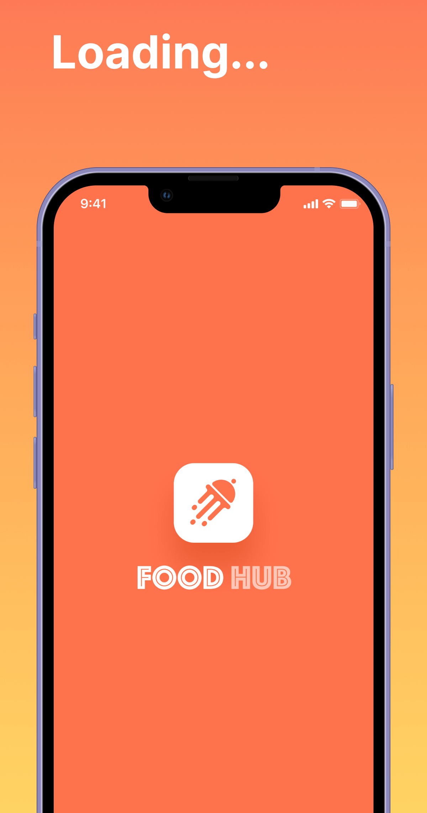
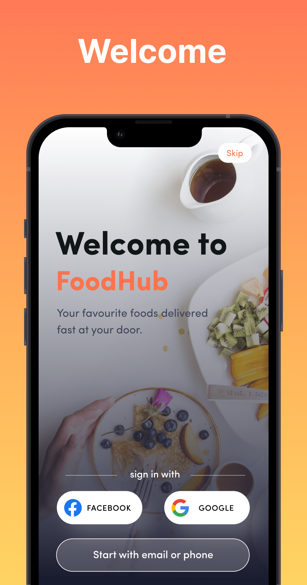 
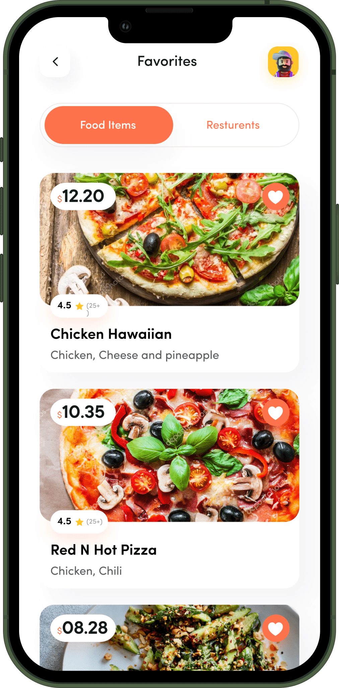 
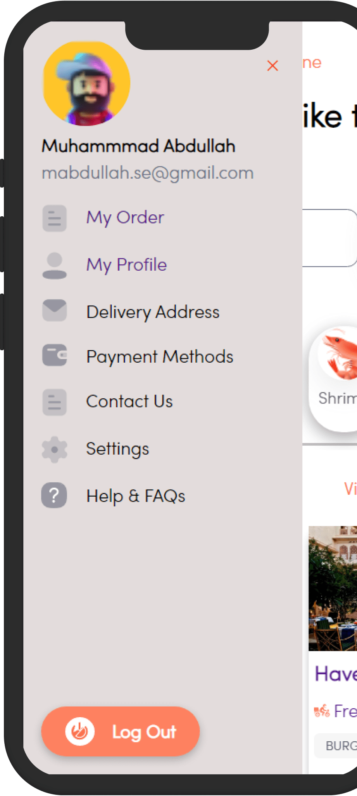 
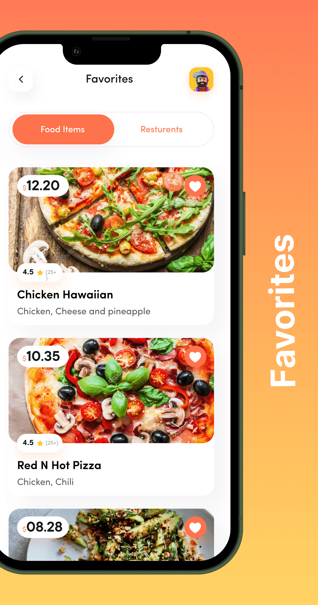 
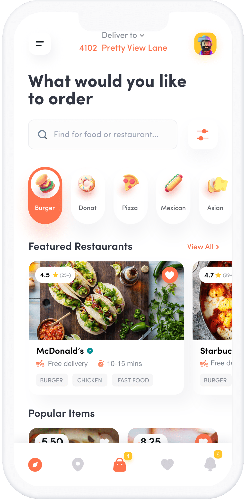 
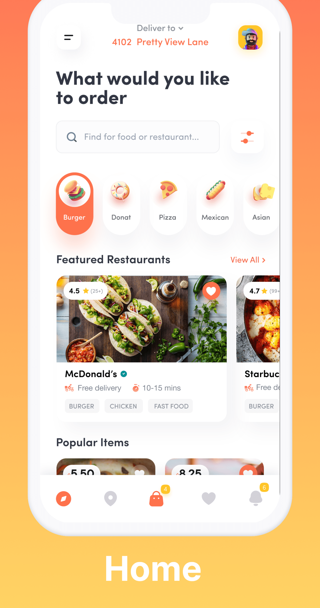 
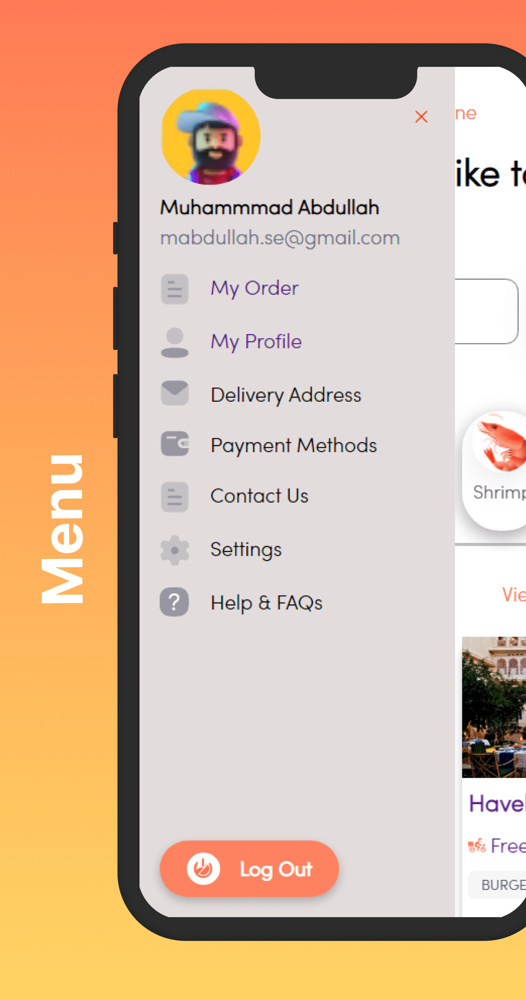 
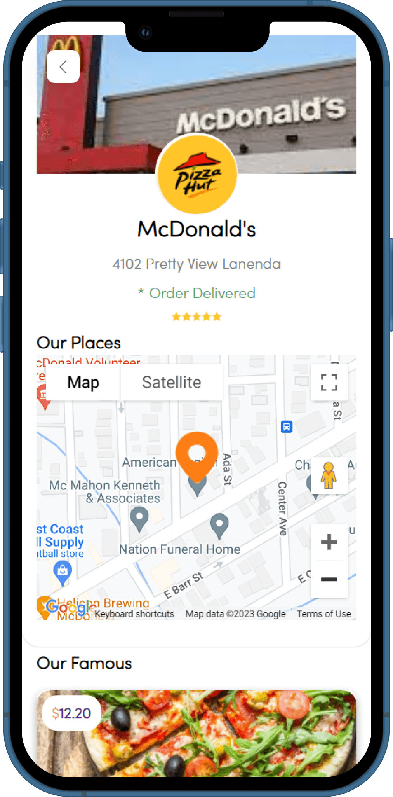 
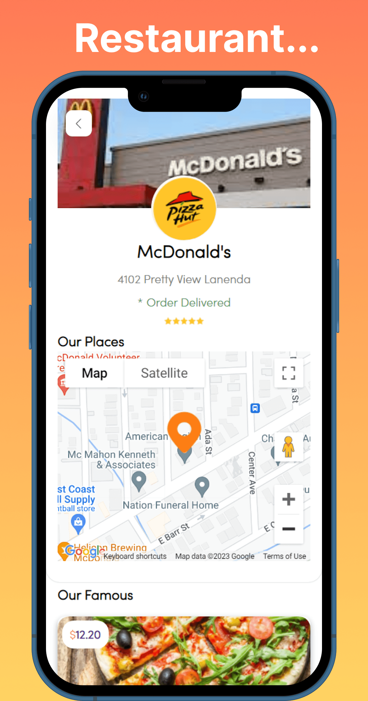 
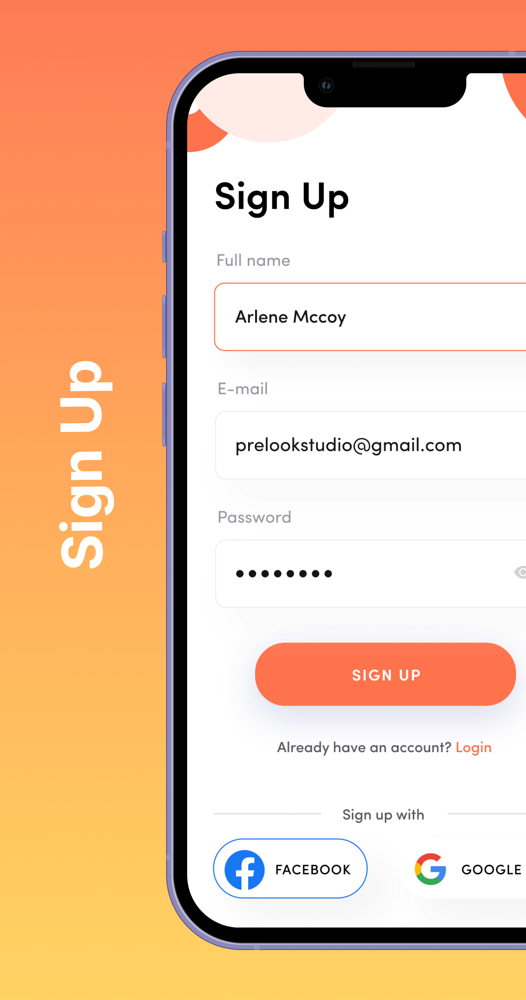 


 
 

 


 

## 🛠 Technologies
- @react-google-maps/api
- react-dom
- react-spring
- react-swipeable-bottom-sheet
- styled-components
- styled-components-modifiers


## Features

- Singup
- Login 
- Food Categories, its details, add to cart, reviews
- Resturents, its details
- using Environment Variables


## 🔗 Links
[](https://mabdullahse.com/)
[](https://www.linkedin.com/in/mabdullahse/)
[](https://twitter.com/mabdullahse)


